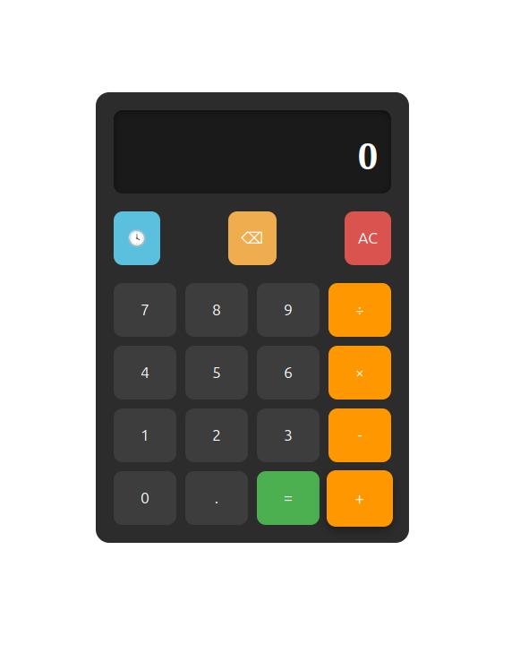

# 🧮 Calculator

A responsive calculator built using **HTML**, **CSS**, and **Vanilla JavaScript**.

## 🚀 Live Demo

👉 https://josu-tomy.github.io/calculator/

## Preview



## ✨ Features

- ➕ Addition
- ➖ Subtraction
- ✖️ Multiplication
- ➗ Division
- 🔢 Decimal support
- ⌫ Backspace
- 🧹 Clear (AC)
- ✅ Input validation
- 📱 Responsive design

## 🛠 Technologies Used

- HTML5
- CSS3
- JavaScript (ES6)

## 🚀 How to Run

1. Clone the repository

```bash
git clone git@github.com:josu-tomy/calculator.git
```

2. Open the project folder.

3. Open `index.html` in your browser.

## 📌 Future Improvements

- Scientific Calculator
- Keyboard Support
- Calculation History
- Dark/Light Theme
- Memory Functions

## 👨‍💻 Author

**Josu Tomy**
